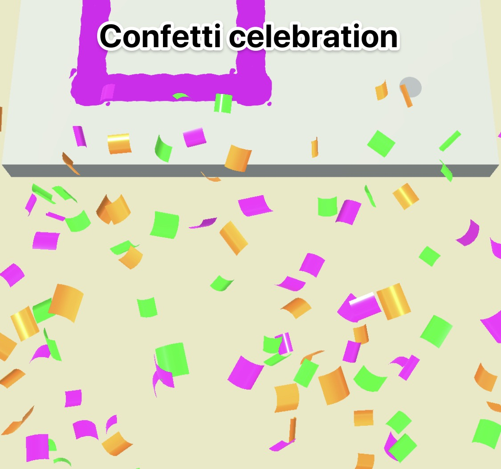

## Scene Tips

### WATER

Including water in a game can increase a game’s performance by 20%.

**Attractive Water is…**

- Animated, NOT static
- Light and bright
- Uses an animated water texture, not a low poly water mesh

### SKY

Pay attention to your sky. An ugly sky can harm a game’s KPIs.

**Sky Colors**:

### CELEBRATE SUCCESS

Celebrate player achievements to reward them.

**End Screen**: Call out the player’s achievement. 
You may also include some reward type (for example, in-game currency, decorative items, or special powers).

**Particles**:

**Pop-up Text**: Mid-game, text pop-ups can indicate a notable success. 
For instance, “COMBO x3”, “COMBO x4”, and so on. 
This text should fade quickly and not get in the way of the action.

### CELEBRATE FAILURE, TOO

To keep players motivated, failure should be celebrated as well.

- **Make it Entertaining**: Making failure funny or dramatic will keep the player invested rather than frustrated.
- **Be encouraging**: **Never make the player feel bad about failure.**

    
