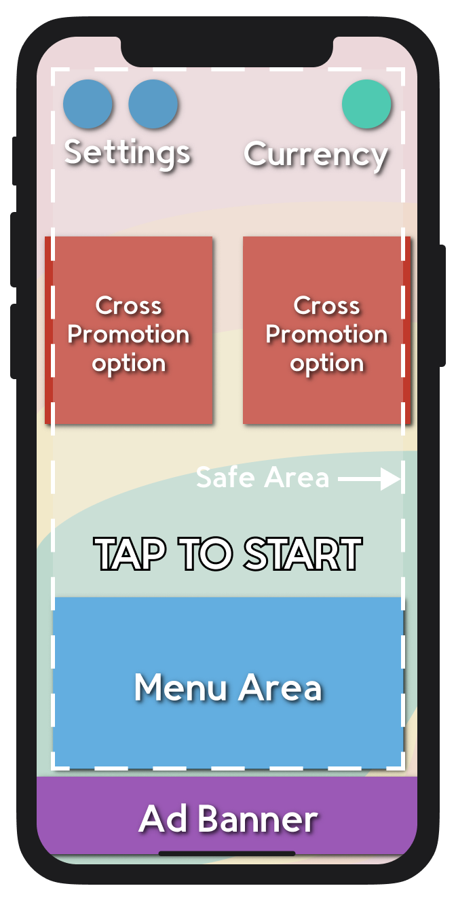
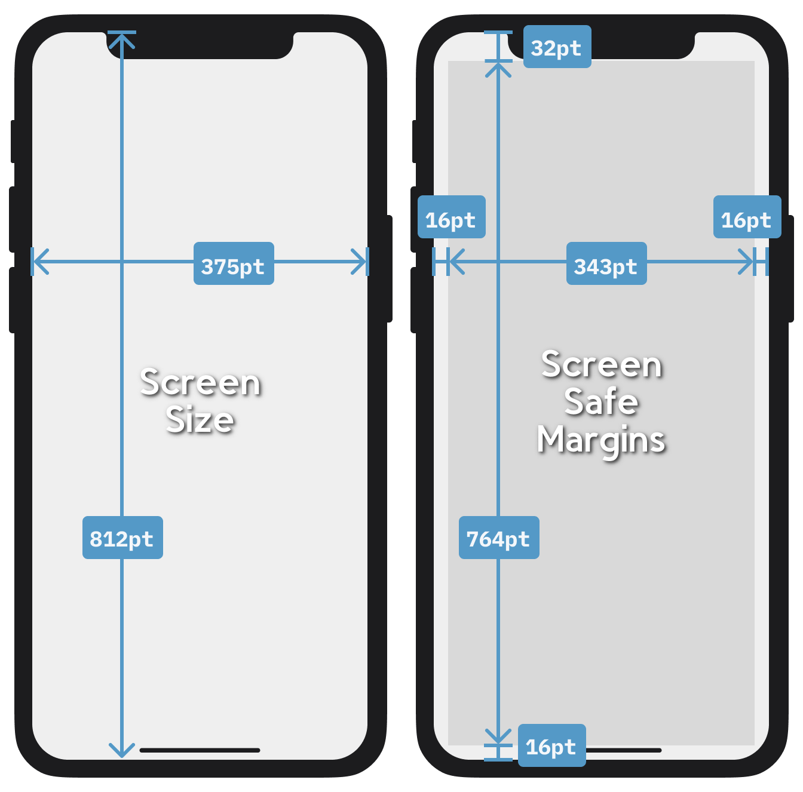
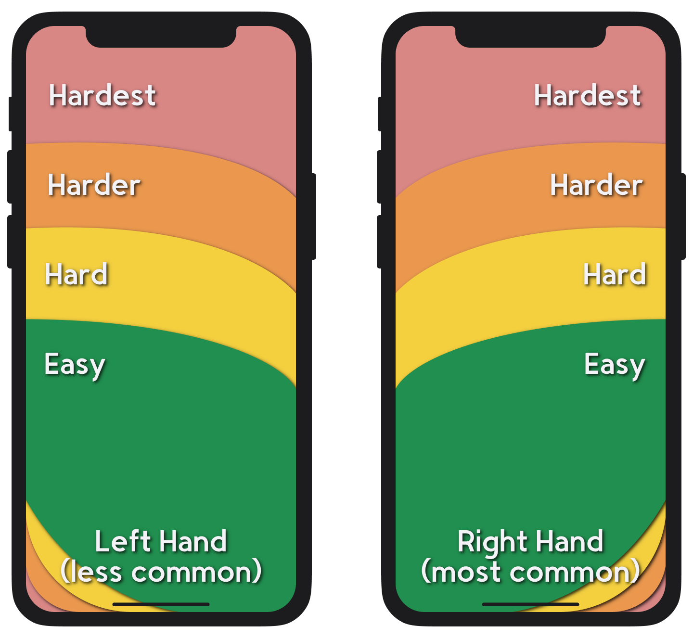
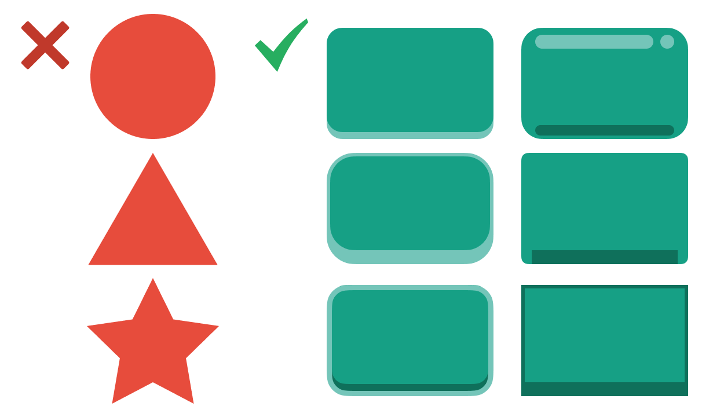
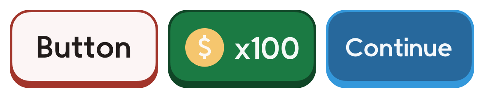
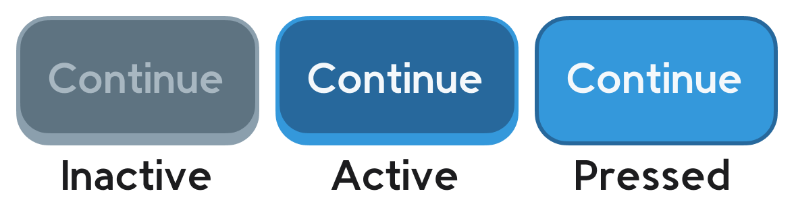

## UI Guidelines

While a fancy UI has not been shown to improve sales or retention, a _bad_ UI can harm them. 
**The UI must be be clear and readable above all else**.

### UI TEMPLATE

This is the starting point for our UI designs.

Regardless of design, keep in mind the dimensions and safe areas of our target hardware, currently the iPhone X and newer.

**Note:** On modern high resolution screens, 1pt = 3px

#### Buttons

Buttons must look clickable and use consistent shape and color language to avoid confusion.

##### Placement on Screen

All things being equal, buttons in different positions on the screen have different chances of being clicked:

- **Bottom Right**: 50% chance
- **Bottom Left**: 40% chance
- **Top**: 10% chance

**Reachability:**

This differs by phone model, but gives a general idea of the reachability of a newer iPhone model.

#### PLAY Button

Rather than a PLAY button, the start “button” should be bold outlined text reading “TAP TO START”.

#### Design Tips for All Buttons

- **Rectangular and 3D(ish)**: Don’t get too creative with button shapes, and make them look “pushable”, even if only slightly.

    

- **44pt x 44pt Touch Size (minimum)**: Visually, a button can be as small as 32pt square but MUST have an actual touch area of 44pt that does not overlap any other touch area.
- **High Contrast**: Contrast applies to the button’s background compared to the button text and outline. Higher contrast is easier to read and offers greater accessibility.
- **Limited Colors**: Use at most one color for text, one for an outline, and another for the button itself. Monochrome or analogous color schemes are best.
- **Consistent Designs**: Each new color or shape must convey new and consistent information. For example, if green is established to mean money, it should always relate to money.

    

- **Communicative Visual States**: There should be a clear visual distinction between the different states of a button.

    

**Note**: These are only examples.

### BUILD FOR EXTENSIBILITY

Break the UI into multiple prefabs so you can alter or update it without pushing everything. 
Each view should have its own prefab.
For example, Main Menu, Win Screen, Lose Screen, Options Screen, and so on should be separated into different prefabs.