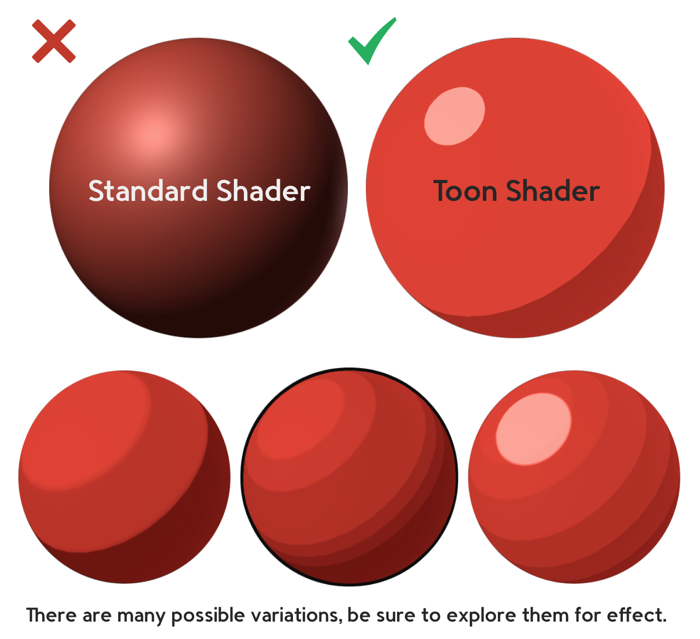
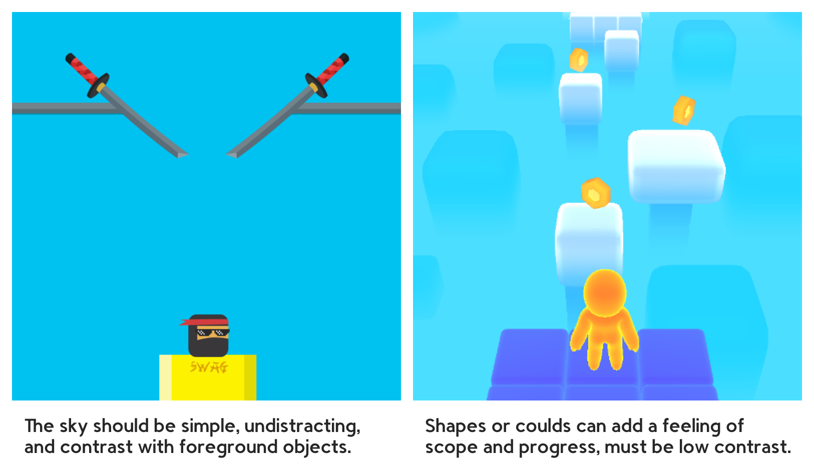

## Graphics Standards

### COLORS

The colors you choose should be fun, comfortable, and inviting.
Colors that are too aggressive, or that clash, will drive players away.

**Improving Colors:**

##### Forbidden Colors

Pure black and pure white can be used sparingly in UI graphics.

### SHAPE LANGUAGE

Second only to color is shape language.

**Once your shape language is defined, stick to it.**

### CONTRAST

Contrast identifies points of interest, and separates active and passive elements.

These are only guidelines, **most important is to make your game readable.**

#### The B&W Test

Take a screenshot or render and make it black and white.
Study how distinct and readable objects are, especially against their backgrounds.

### SHADERS

**Don’t use the Unity Standard Shader:**

- **Minimalist - Lowpoly Flat/Gradient Shader**: A very lightweight shader
- **Toony Colors Pro 2**: More complicated with more features than Minimalist
- **MK Toon**: On the complicated side, but has a number of interesting stylization and light options

### LIGHTING & SHADOWS

Lights and shadows must be used well if they are used at all.

#### Performance

Toon and other “unlit” shaders do not react to lights in the usual way, but shadows still impact performance.
If you have a complicated or detailed scene and have performance problems, try turning shadows off for some objects, maybe all of them.
Unlit shaders with no shadows look flat, so do this strategically.

#### Lights

The only real light in a scene should be a directional light, which is added to a new scene by default.

#### Shadows

### PARTICLES & FX

### CHARACTERS

- Hypercasual style
- Gummy
- Solid color

## Scene Tips

### WATER

Including water in a game can increase a game’s performance by 20%.

**Attractive Water is…**

- Animated, NOT static
- Light and bright
- Uses an animated water texture, not a low poly water mesh

### SKY

Pay attention to your sky. An ugly sky can harm a game’s KPIs.

**Sky Colors**:

### CELEBRATE SUCCESS

Celebrate player achievements to reward them.

**End Screen**: Call out the player’s achievement.
You may also include some reward type (for example, in-game currency, decorative items, or special powers).

**Particles**:

**Pop-up Text**: Mid-game, text pop-ups can indicate a notable success.
For instance, “COMBO x3”, “COMBO x4”, and so on.
This text should not get in the way of the action.

### CELEBRATE FAILURE, TOO

To keep players motivated, failure should be celebrated as well.

- **Make it Entertaining**: Make it funny or dramatic.

- **Be encouraging**: **Never make the player feel bad about failure.**

## UI Guidelines

While a fancy UI has not been shown to improve sales or retention, a _bad_ UI can harm them.
**The UI must be be clear and readable above all else**.

### UI TEMPLATE

This is the starting point for our UI designs.

#### Buttons

Buttons must look clickable and use consistent shape and color language to avoid confusion.

##### Placement on Screen

Buttons in different positions on the screen have different chances of being clicked:

- **Bottom Right**: 50% chance
- **Bottom Left**: 40% chance
- **Top**: 10% chance

**Reachability:**

This differs by phone model, but gives a general idea of the reachability of a newer iPhone model.

#### PLAY Button

Rather than a PLAY button, the start “button” should be bold outlined text reading “TAP TO START”.

#### Design Tips for All Buttons

- **Rectangular and 3D(ish)**:

- **44pt x 44pt Touch Size (minimum)**: Visually, a button can be as small as 32pt square but MUST maintain enough space around it to have an actual touch area of 44pt.
- **High Contrast, Limited Colors**: This applies to the button’s background, as well as the button text. At most use one color for text, one for an outline, and another for the button itself (use monochrome or analogous colors).
- **Consistent Designs**: Each new color or shape must convey new and consistent information.

- **Communicative Visual States**:

These are only examples.

### BUILD FOR EXTENSIBILITY

Break the UI into multiple prefabs so you can alter or update it without pushing everything.
Each view should have its own prefab, for example, Main Menu, Win Screen, Lose Screen, Options Screen, and so on.

## Optimization

### MESHES/MODELS

Meshes are made up of flat surfaces called polygons.
Polygons are what is rendered to the screen.

#### Triangulation

Polygon counts in Unity are always measured in tris, and Unity will split any imported model into tris (possibly not very well, you may have to triangulate the mesh yourself).

_NOTE: Triangulated models are harder to edit, so save an un-triangulated copy first._

#### Polycount

To avoid performance problems, limit the scene's overall polycount by making the assets as efficiently as possible.
Target poly counts change depending on size, distance, and importance.

**Recommended Object Polycounts:**

- **Small/Distant/Tertiary Props** \= 100-300 tris
- **Medium/Secondary Props** \= 400-800 tris
- **Large/Close/Hero Props** \= 900-1500 tris

#### LOD (Level Of Detail)

Objects that are close to the camera at times and far away at others should use LODs.
For example, a hero object with 1200 tris may have a 600 tri version for the middle distance, a 150 tri version for the far distance, and a flat 2D version for extreme distances.

### TEXTURES AND OTHER IMAGES

Images usually represent a game’s largest memory hog.
For this reason, images must be optimized.

#### Square, Power of 2

All images used in a game need to **square with pixel dimensions in powers of 2**.
In other words, 2x2, 4x4, 8x8, 16x16, 32x32, and so on (doubles each time).

##### Size Recommendations:

- **32x32** - When using a solid color, it’s possible to go very small; 32x32 is fine.
- **64x64** - When using color indexes, 64 pixels is the smallest recommended size.
- **128x128, 256x256, 512x512** - Most textures should be one of these sizes unless they are very detailed.
- **1024x1024, 2048x2048** - These sizes are often referred to as 1K and 2K, respectively. 1K images are helpful for highly detailed textures. Generally, 2K images should only be used with atlases and exceptionally detailed textures.

Additionally, images can be sized relative to each other based on how large they appear on the screen.
For example, if one image is 1024px in width and spans the screen, and another image spans only halfway across the screen, there is no reason for it to be larger than 512px.

#### Texture Atlases

UI elements and decals are often unusual shapes and rarely fit easily into a square, power of two texture.
For this reason, Unity’s atlas feature should be used.
This leads to larger images, but it can significantly reduce draw calls, as many images can be loaded in one atlas file.
