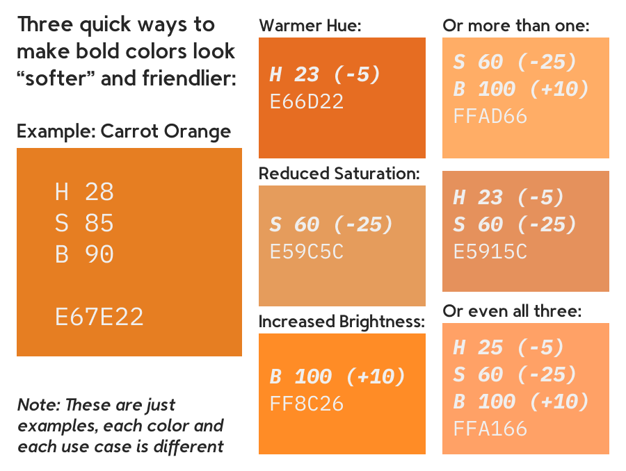
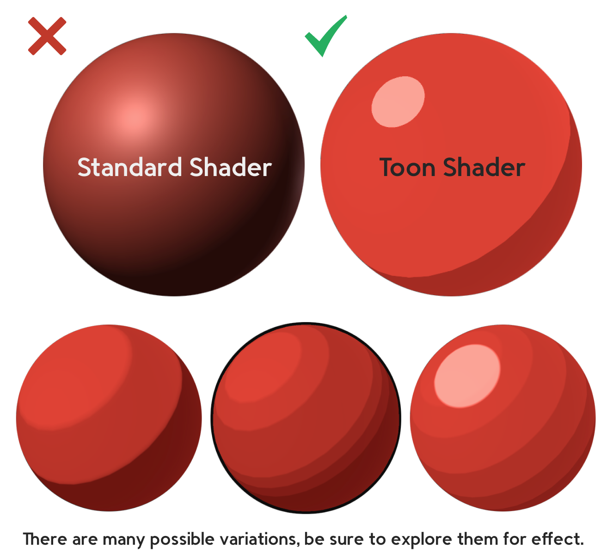
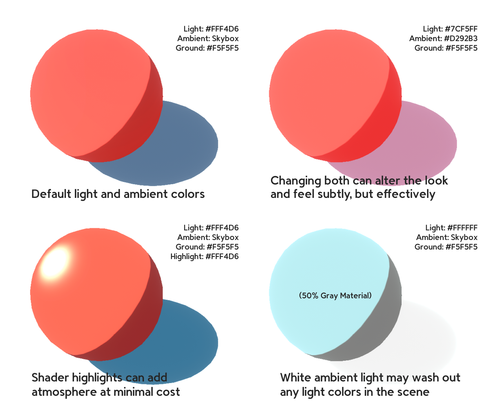

## Graphics Standards

### COLORS

The colors you choose should be fun, comfortable, and inviting. 
Colors that are too aggressive, or that clash, will drive players away.

**Improving Colors:**

##### Forbidden Colors

Pure black and pure white can be used sparingly in UI graphics.

### SHAPE LANGUAGE

Second only to color is shape language.

**Once your shape language is defined, stick to it.**

### CONTRAST

Contrast identifies points of interest, and separates active and passive elements.

These are only guidelines, **most important is to make your game readable.**

#### The B&W Test

Take a screenshot or render and make it black and white. 
Study how distinct and readable objects are, especially against their backgrounds.

### SHADERS

**Don’t use the Unity Standard Shader:**

- **Minimalist - Lowpoly Flat/Gradient Shader**: A very lightweight shader
- **Toony Colors Pro 2**: More complicated with more features than Minimalist
- **MK Toon**: On the complicated side, but has a number of interesting stylization and light options

### LIGHTING & SHADOWS

Lights and shadows must be used well if they are used at all.

#### Performance

Toon and other “unlit” shaders do not react to lights in the usual way, but shadows still impact performance. 
If you have a complicated or detailed scene and have performance problems, try turning shadows off for some objects, maybe all of them. 
Unlit shaders with no shadows look flat, so do this strategically.

#### Lights

The only real light in a scene should be a directional light, which is added to a new scene by default.

#### Shadows

### PARTICLES & FX

### CHARACTERS

- Hypercasual style
- Gummy
- Solid color