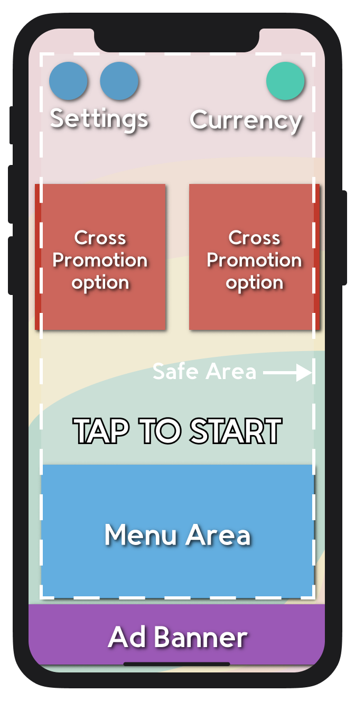
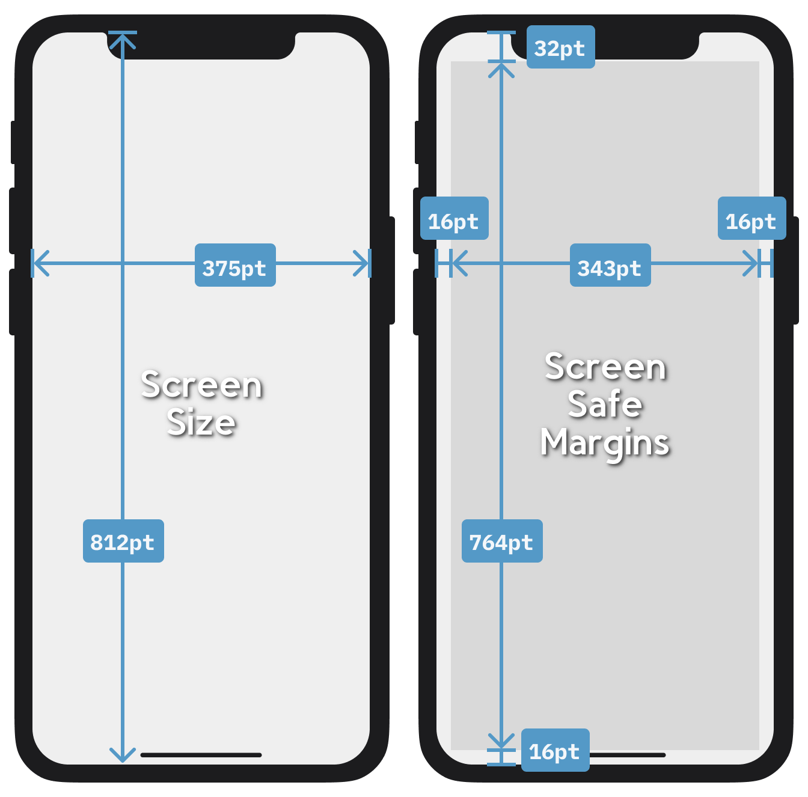
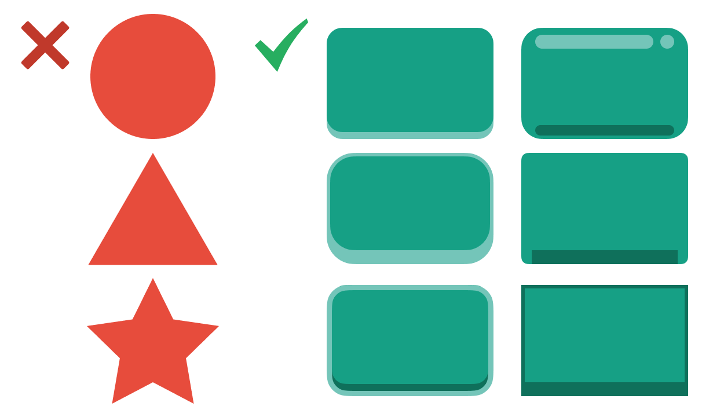

## UI Guidelines

While a fancy UI has not been shown to improve sales or retention, a _bad_ UI can harm them. 
**The UI must be be clear and readable above all else**.

### UI TEMPLATE

This is the starting point for our UI designs.

#### Buttons

Buttons must look clickable and use consistent shape and color language to avoid confusion.

##### Placement on Screen

Buttons in different positions on the screen have different chances of being clicked:

- **Bottom Right**: 50% chance
- **Bottom Left**: 40% chance
- **Top**: 10% chance

**Reachability:**

This differs by phone model, but gives a general idea of the reachability of a newer iPhone model.

#### PLAY Button

Rather than a PLAY button, the start “button” should be bold outlined text reading “TAP TO START”.

#### Design Tips for All Buttons

- **Rectangular and 3D(ish)**:
    

- **44pt x 44pt Touch Size (minimum)**: Visually, a button can be as small as 32pt square but MUST maintain enough space around it to have an actual touch area of 44pt.
- **High Contrast, Limited Colors**: This applies to the button’s background, as well as the button text. At most use one color for text, one for an outline, and another for the button itself (use monochrome or analogous colors).
- **Consistent Designs**: Each new color or shape must convey new and consistent information.
    

- **Communicative Visual States**:
    

These are only examples.

### BUILD FOR EXTENSIBILITY

Break the UI into multiple prefabs so you can alter or update it without pushing everything. 
Each view should have its own prefab, for example, Main Menu, Win Screen, Lose Screen, Options Screen, and so on.